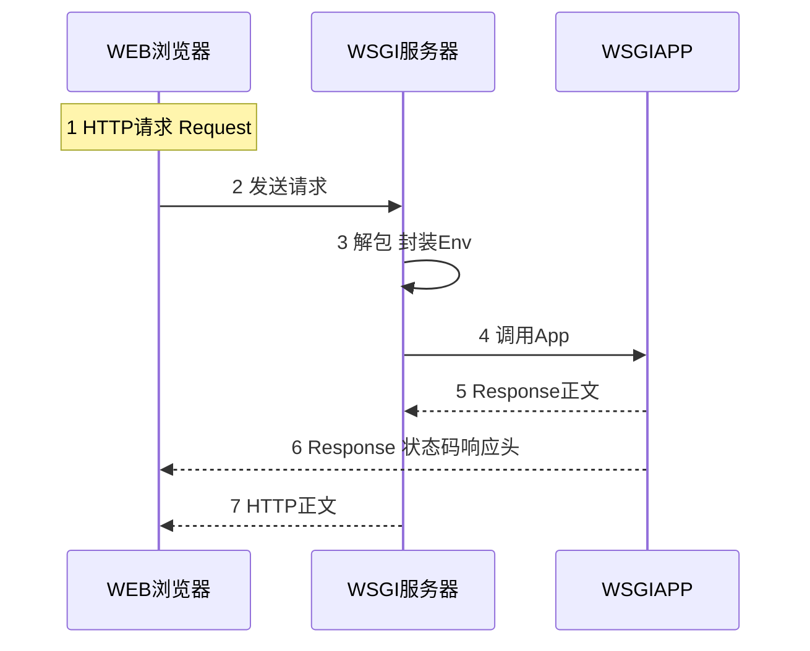

##  WSGI
----

__*It is important to understand the basic principles.*__

基本功很重要

----

 __WSGI原理__  

WSGI 指定了 web 服务器和 Python web 应用之间的标准接口，流程如下：

1 Server/Gateway: 即HTTP Server, 负责从客户端(Nnginx、apache、IIS）接收请求,将 request 转发给 application, 并将 application（可能是个Flask应用） 返回的response 返回给客户端

2 Application/Framework: 一个python web 应用或 web 框架接收由 server 转发的request，处理请求，并将处理结果返回给 server
  

 __WSGI流程__  

 
a

 

__WSGI_请求-响应模式__ 
 
+ 组织请求
+ 由请求构建响应
+ 返回数据
+ 服务器启动并响应
<pre>

#创建应用
def application(environ, start_response):
    request = Request(environ)
    response = Response("Hello %s!" % request.args.get('name', 'World!'))
    return response(environ, start_response)

#创建服务器
httpd = make_server('', 8000, application)

#监听服务器
httpd.serve_forever()
</pre>
