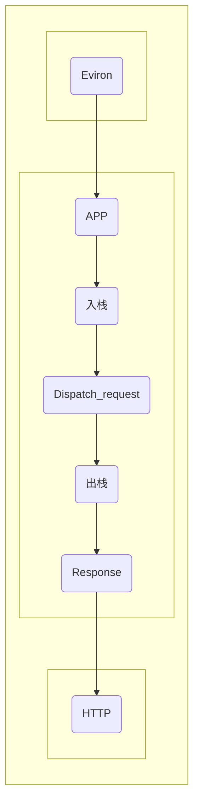

##  Flask 
----

__*Explicit is better than implicit.*__

清晰胜于晦涩

----

 

__FLASK简介__  

 

Flask 有两个核心依赖库： werkzeug 和 jinja.werkzeug 负责核心的逻辑模块，比如路由、请求和应答的封装； jinja 负责模板的渲染，不作介绍. Flask 源码分析主要从 FLASK 流程及文档两方面进行分析.

 

__FLASK流程__  

 

+ 1 Flask 对象初始化
+ 2 路由系统注册视图函数
+ 3 Flask 请求-响应

接收请求--创建请求上下文--请求上下文入栈--创建该请求的应用上下文--应用上下文入栈--处理逻辑--请求上下文出栈--应用上下文出栈--response--HTTP

 

__FLASK文档结构__  

+ 1 FLASK —— 流程
+ 2 JSON —— JSON 数据序列化
+ 3 APP —— FLASK 启动文件
+ 4 Blueprints —— 蓝图
+ 5 Config —— 配置文件
+ 6 Globals —— 生成对象
+ 7 Scaffold —— FLASK父类
+ 8 Sessions —— 会话管理
+ 9 Views —— 视图
+ 10 Wrappers —— 装饰器
+ 11 Singals —— 信号文档
