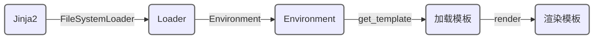

## APP
----

__*Although that way may not be obvious at first unless you're Dutch*.__

----

 __Jinja2简介:__ 模板引擎，负责HTML文件渲染. 

 __Jinja2流程:__ 

 __注:__ 
 + FileSystemLoader:加载当前工作目录下的templates目录下的模板文件

+ EnvironmentP:存储配置信息, 全局对象, 从文件系统加载模板.

+ get_template():加载模板.

+ render():渲染模板.

